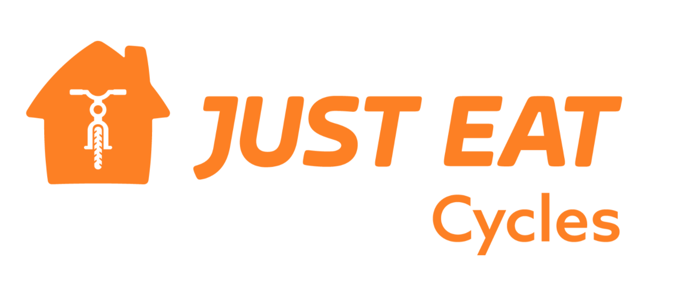
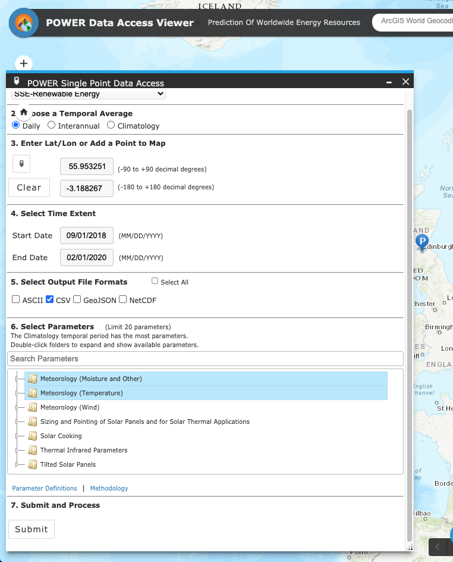

```{r setup, include=FALSE}
knitr::opts_chunk$set(echo = TRUE, fig.align = 'center')

```


```{r, echo=FALSE, out.width = '80%'}

```


<br>

# The data

Do you want to analyse how Just Eat Cycles works, visualise movements in the city, add cycle hire to your own app, or do you have other interesting ideas? We’ve got the data that gets you going.

<br>

**[You can find the data here](https://edinburghcyclehire.com/open-data) **

<br>

You may also want to investigate how the weather has had an effect on any bike rentals. **[This website here allows you to download historical weather data as csv files.](https://power.larc.nasa.gov/data-access-viewer/)**

You can see the settings we picked, here. *Note: make sure you remove the metadata at the top of the csv file you download. We had to skip 20 rows in ours*. 

<br>

<br>

```{r, echo = FALSE, out.width= '50%'}

```


<br><br>

# The Brief 

Download as much as you want, and explore how total hours and distances of journeys change over time. 

<br>


# Questions of interest

Some questions you might be interested in:

* How many hours of cycling have just eat bikes been used for?  
* What distances do people cycle on them?  
* Are there most popular start and stop locations?  
* Are there any seasonal or weekly trends?  
* How as a business would we plan and allocate bike station locations and number of bikes?

<br>

# Your findings

You should produce a business report of your findings. 


